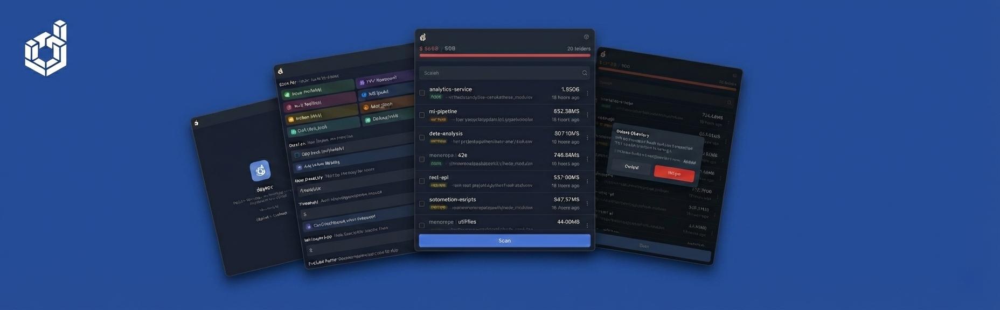

# 𝌤 deptox

[](https://www.apple.com/macos/)
[](https://tauri.app/)
[](https://codecov.io/gh/alexwhin/deptox)




macOS menubar app for reclaiming disk space from dependency directories scattered across your filesystem.

Gigabytes sitting idle in forgotten `node_modules`, `vendor`, `Pods`, and `.venv` folders. deptox finds them, shows you what's consuming space, and lets you delete them selectively—all from your menubar.

## Why deptox?

Every project you clone or experiment with leaves behind dependency folders. That _"I'll get back to this"_ repo from six months ago still has 800MB of packages sitting there. Multiply that across dozens of projects and you're looking at tens of gigabytes of wasted space.

**deptox gives you control:**

- **Fast scanning** across your entire filesystem
- **Multi-language support** (TypeScript, PHP, Ruby, iOS, Python, Elixir, Dart, Go)
- **Safe deletion** via Trash (easily recoverable)
- **Threshold alerts** when space usage exceeds your limit
- **Background monitoring** with periodic scans

## Installation

### Download

Grab the latest release from [GitHub Releases](https://github.com/alexwhin/deptox/releases).

> **Important**: macOS may show "deptox.app is damaged and can't be opened" because the app is not notarised with Apple. After downloading, run this command in Terminal to allow the app to open:
>
> ```bash
> xattr -cr /Applications/deptox.app
> ```

### Build from Source

```bash
git clone https://github.com/alexwhin/deptox.git
cd deptox
pnpm install
pnpm tauri build
```

## Quick Start

1. Click the deptox icon in your menubar
2. The app scans from your home directory automatically
3. Click any directory to open it in Finder
4. Use the context menu (⋮) to:
   - Rescan a specific directory
   - Delete to Trash
5. Access settings via the gear icon to:
   - Choose which dependency types to scan
   - Set your alert threshold
   - Change the root scan directory

## Internationalization

Currently supports 12 languages (automatic language detection based on system settings):

🇬🇧 English 🇩🇪 German 🇪🇸 Spanish 🇫🇷 French 🇮🇳 Hindi 🇮🇹 Italian

🇯🇵 Japanese 🇰🇷 Korean 🇵🇹 Portuguese 🇷🇺 Russian 🇨🇳 Chinese 🇸🇦 Arabic

## Supported Directory Types

| Type           | Language/Framework | Typical Size |
| -------------- | ------------------ | ------------ |
| `node_modules` | Node.js/JavaScript | 100MB - 1GB+ |
| `vendor`       | PHP/Composer       | 50MB - 500MB |
| `vendor`       | Ruby/Bundler       | 50MB - 300MB |
| `Pods`         | iOS/CocoaPods      | 100MB - 1GB+ |
| `.venv`/`venv` | Python virtualenv  | 50MB - 300MB |
| `deps`         | Elixir/Mix         | 20MB - 200MB |
| `.dart_tool`   | Dart/Flutter       | 10MB - 100MB |
| `pkg/mod`      | Go modules         | 50MB - 500MB |

## Safety Features

- **Trash integration**: Deleted directories go to macOS Trash, not permanent deletion
- **Symlink detection**: Warns when directories contain only symbolic links
- **iCloud awareness**: Identifies directories stored in iCloud requiring download before deletion
- **Size verification**: Shows exact space consumption before deletion

## Development

```bash
pnpm tauri dev        # Start app in dev mode

pnpm test             # Run all tests
pnpm test:ts          # Frontend tests only
pnpm test:rust        # Backend tests only

pnpm build            # Build frontend
pnpm tauri build      # Build production app

npx tsc --noEmit      # TypeScript type checking
```

## Privacy

deptox operates entirely locally. No data is collected, transmitted, or stored externally. Filesystem scanning happens on your machine, results stay on your machine. Please see [PRIVACY.md](PRIVACY.md) for details.

## Contributing

Contributions welcome! Please read [CONTRIBUTING.md](CONTRIBUTING.md) for guidelines on submitting issues and pull requests.

### Commit Convention

This project uses [Conventional Commits](https://www.conventionalcommits.org/). Commit messages are enforced via commitlint.

Format: `type(scope): subject`

**Types**: `feat`, `fix`, `docs`, `style`, `refactor`, `perf`, `test`, `build`, `ci`, `chore`

Examples:

```bash
feat: add threshold customization to settings
fix: prevent deletion of symlink-only directories
docs: update installation instructions
```

## Distribution

Distributed via **GitHub Releases** as downloadable `.dmg` files with built-in auto-updates. App Store sandboxing restricts filesystem access to only user-selected files. Since deptox needs to scan your entire filesystem for dependency directories, a sandboxed version would defeat the app's core purpose.

## Releasing

For maintainers:

- [VERSION_MANAGEMENT.md](VERSION_MANAGEMENT.md) - Modern automated version management
- [RELEASE.md](RELEASE.md) - Complete release process, builds, and code signing

## License

This project is released under the MIT License.
Created and maintained by [Alex Whinfield](https://github.com/alexwhin).
